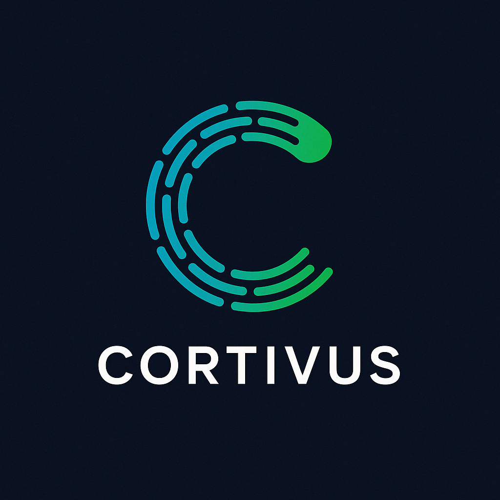

# Cortivus Website Improvements - Product Requirements Document

**Document Version:** 1.0
**Date Created:** 2025-11-06
**Status:** Ready for Implementation
**Owner:** Development Team

---

## Executive Summary

This PRD outlines improvements for the Cortivus website (cortivus.com) identified through comprehensive code and performance analysis. Issues are categorized by priority and impact, with clear implementation steps for each.

**Current State:** Functional website with solid design but performance, SEO, and code quality issues.
**Goal:** Optimize for speed, search visibility, accessibility, and maintainability.

---

## Table of Contents

1. [Critical Issues](#critical-issues) (High Priority)
2. [Important Issues](#important-issues) (Medium Priority)
3. [Nice-to-Have Improvements](#nice-to-have-improvements) (Low Priority)
4. [Implementation Phases](#implementation-phases)
5. [Success Metrics](#success-metrics)
6. [Technical Resources](#technical-resources)

---

## Critical Issues

### 🔴 ISSUE #1: Image Optimization

**Priority:** CRITICAL
**Impact:** Page load speed, user experience, SEO rankings
**Effort:** 2-3 hours
**Status:** Not Started

#### Problem
Extremely large, unoptimized images significantly slow page load times:
- `logo.png`: 1.7MB (should be <50KB)
- `front_page.png`: 2.7MB (should be <300KB)
- `the_why.png`: 3.2MB (should be <300KB)
- **Total: ~9MB of images**

#### Impact
- Slow initial page load (especially mobile)
- Poor Google PageSpeed scores
- Higher bounce rates
- Increased hosting bandwidth costs

#### Solution
1. Compress all PNG images to 80-90% smaller using TinyPNG or ImageOptim
2. Convert to WebP format with PNG fallback
3. Create multiple sizes for responsive images
4. Implement `srcset` for different screen sizes

#### Implementation Steps
```bash
# 1. Install optimization tools
npm install -g @squoosh/cli

# 2. Optimize each image
squoosh-cli --webp auto images/*.png

# 3. Update HTML to use picture element
```

```html
<!-- Example for logo -->
<picture>
  <source srcset="images/logo.webp" type="image/webp">
  
</picture>
```

#### Acceptance Criteria
- [ ] All images under recommended sizes
- [ ] WebP versions created with PNG fallbacks
- [ ] Page load time under 3 seconds on 3G
- [ ] PageSpeed score > 90

---

### 🔴 ISSUE #2: Missing SEO Meta Tags

**Priority:** CRITICAL
**Impact:** Search visibility, social sharing, organic traffic
**Effort:** 1-2 hours
**Status:** Not Started

#### Problem
Zero meta descriptions across all 6 HTML pages. No Open Graph or Twitter Card tags.

#### Impact
- Poor search engine rankings
- Unappealing social media previews
- Lost organic traffic opportunities
- Lower click-through rates from search results

#### Solution
Add comprehensive meta tags to all pages.

#### Implementation Steps

**For index.html:**
```html
<head>
  <!-- Existing tags -->

  <!-- Meta Description -->
  <meta name="description" content="Cortivus builds AI-powered applications that solve real problems in healthcare, faith, and hospitality. Discover Journey2Health, Sermon Generator, and MakeItADouble.">

  <!-- Open Graph / Facebook -->
  <meta property="og:type" content="website">
  <meta property="og:url" content="https://cortivus.com/">
  <meta property="og:title" content="Cortivus - AI & Technology Solutions">
  <meta property="og:description" content="Building AI-Powered Apps That Solve Real Problems">
  <meta property="og:image" content="https://cortivus.com/images/front_page.png">

  <!-- Twitter -->
  <meta name="twitter:card" content="summary_large_image">
  <meta name="twitter:url" content="https://cortivus.com/">
  <meta name="twitter:title" content="Cortivus - AI & Technology Solutions">
  <meta name="twitter:description" content="Building AI-Powered Apps That Solve Real Problems">
  <meta name="twitter:image" content="https://cortivus.com/images/front_page.png">

  <!-- Additional SEO -->
  <meta name="keywords" content="AI applications, healthcare AI, digital health, sermon generator, hospitality AI">
  <meta name="author" content="Cortivus">
  <link rel="canonical" href="https://cortivus.com/">
</head>
```

**Meta Descriptions for Each Page:**

| Page | Meta Description |
|------|------------------|
| index.html | "Cortivus builds AI-powered applications that solve real problems in healthcare, faith, and hospitality. Discover Journey2Health, Sermon Generator, and MakeItADouble." |
| portfolio.html | "Explore Cortivus's portfolio of AI-powered applications: Journey2Health for healthcare, Sermon Generator for faith leaders, and MakeItADouble for hospitality." |
| team.html | "Meet the team behind Cortivus - experienced leaders in AI, healthcare, and software development building practical AI solutions." |
| pitch.html | "Learn about Journey2Health, Cortivus's AI-powered digital health assistant for chronic disease management." |
| sermongenerator.html | "Discover Sermon Generator - AI-powered content creation tool for faith leaders and pastors." |
| onboarding/index.html | "AMC onboarding for MakeItADouble - smart bar assistant for event venues." |

#### Acceptance Criteria
- [ ] All 6 pages have unique meta descriptions
- [ ] All pages have Open Graph tags
- [ ] All pages have Twitter Card tags
- [ ] Social media preview looks correct when testing with Facebook Debugger and Twitter Card Validator
- [ ] Meta descriptions are 150-160 characters

---

### 🔴 ISSUE #3: Duplicate & Dead Chatbot Code

**Priority:** CRITICAL
**Impact:** Code maintainability, page load speed, developer confusion
**Effort:** 1 hour
**Status:** Not Started

#### Problem
Multiple versions of chatbot files causing confusion:
- `/js/chatbot/chat.js` (37KB)
- `/js/chatbot/chat1.js` (32KB)
- `/js/chatbot/ui.js` (14.9KB)
- `/js/chatbot/ui1.js` (14KB)
- `/js/chatbot/chat_old.js` (13KB) ← Legacy
- `/js/chatbot/ui_old.js` (10.5KB) ← Legacy

Total: ~130KB of potentially redundant code

#### Impact
- Confusion about which files are active
- Unnecessary bandwidth usage
- Harder maintenance
- Potential bugs

#### Solution
1. Identify which chatbot files are actually used
2. Remove unused/legacy files
3. Document the final chatbot architecture

#### Implementation Steps
1. Audit which files are referenced in HTML pages
2. Test chatbot functionality
3. Delete unused files:
   ```bash
   rm js/chatbot/chat_old.js
   rm js/chatbot/ui_old.js
   rm js/chatbot/chat1.js  # if unused
   rm js/chatbot/ui1.js    # if unused
   ```
4. Update git to track deletion
5. Document active files in README

#### Acceptance Criteria
- [ ] Only active chatbot files remain
- [ ] Chatbot still functions (if enabled)
- [ ] Documentation updated
- [ ] Git history shows deleted files

---

### 🔴 ISSUE #4: Inconsistent Chatbot Integration

**Priority:** CRITICAL
**Impact:** User experience consistency, code maintenance
**Effort:** 2 hours
**Status:** Not Started

#### Problem
Chatbot is disabled on `index.html` but enabled on `portfolio.html` with different initialization code.

**index.html:245-258** - Commented out
**portfolio.html:107-143** - Complex initialization

#### Decision Required
**Option A:** Enable chatbot site-wide
**Option B:** Remove chatbot entirely

#### Solution (Option A - Enable Site-wide)
1. Create unified `chatbot-loader.js` that works across all pages
2. Enable on all pages with same initialization
3. Test thoroughly

#### Solution (Option B - Remove Entirely)
1. Remove all chatbot files from `/js/chatbot/`
2. Remove all chatbot script tags from HTML
3. Remove chatbot demo data

#### Implementation Steps (Option A)
```javascript
// js/chatbot-loader.js
(function() {
  'use strict';

  function initChatbot() {
    if (window.CortivusChatUI && window.CortivusChat) {
      window.CortivusChatUI.initialize();
      window.CortivusChat.initialize();
    }
  }

  if (document.readyState === 'loading') {
    document.addEventListener('DOMContentLoaded', initChatbot);
  } else {
    initChatbot();
  }
})();
```

Add to all pages:
```html
<script src="js/chatbot/ui.js"></script>
<script src="js/chatbot/chat.js"></script>
<script src="js/chatbot-loader.js"></script>
```

#### Acceptance Criteria
- [ ] Chatbot loads consistently on all pages OR is completely removed
- [ ] No console errors
- [ ] Decision documented in README

---

## Important Issues

### 🟡 ISSUE #5: Accessibility Gaps

**Priority:** HIGH
**Impact:** User reach, legal compliance, SEO
**Effort:** 3-4 hours
**Status:** Not Started

#### Problem
Missing accessibility features:
- No skip navigation link
- Missing ARIA labels on some elements
- No form validation announcements
- Potential color contrast issues

#### Solution
Implement WCAG 2.1 AA compliance improvements.

#### Implementation Steps

**1. Add Skip Link**
```html
<!-- Add at top of body in all pages -->
<a href="#main" class="skip-link">Skip to main content</a>
```

```css
/* Add to styles.css */
.skip-link {
  position: absolute;
  top: -40px;
  left: 0;
  background: var(--primary-color);
  color: var(--dark-bg);
  padding: 8px;
  text-decoration: none;
  z-index: 9999;
}

.skip-link:focus {
  top: 0;
}
```

**2. Add ARIA Labels**
```html
<!-- Navigation -->
<nav aria-label="Main navigation">
  <ul>...</ul>
</nav>

<!-- Forms -->
<form aria-label="Contact form">
  <input type="text" id="name" name="name"
         aria-required="true"
         aria-describedby="name-error">
  <span id="name-error" role="alert" aria-live="polite"></span>
</form>

<!-- Buttons -->
<button aria-label="Toggle mobile navigation menu">
  <i class="fas fa-bars" aria-hidden="true"></i>
</button>
```

**3. Test Color Contrast**
```bash
# Use browser DevTools or online tools
# Check: https://webaim.org/resources/contrastchecker/
```

#### Acceptance Criteria
- [ ] All pages have skip links
- [ ] All interactive elements have ARIA labels
- [ ] Form errors are announced to screen readers
- [ ] All text meets WCAG AA contrast ratio (4.5:1 for normal text)
- [ ] Passes automated accessibility audit (Lighthouse, WAVE)

---

### 🟡 ISSUE #6: Missing Structured Data

**Priority:** HIGH
**Impact:** Search visibility, rich snippets
**Effort:** 2 hours
**Status:** Not Started

#### Problem
No Schema.org structured data for enhanced search results.

#### Solution
Add JSON-LD structured data for Organization, Products, and People.

#### Implementation Steps

**1. Organization Schema (index.html)**
```html
<script type="application/ld+json">
{
  "@context": "https://schema.org",
  "@type": "Organization",
  "name": "Cortivus",
  "description": "AI-powered product studio building practical applications for healthcare, faith, and hospitality",
  "url": "https://cortivus.com",
  "logo": "https://cortivus.com/images/logo.png",
  "foundingDate": "2023",
  "founders": [
    {
      "@type": "Person",
      "name": "Troy E. Sybert",
      "jobTitle": "Founder & CEO"
    }
  ],
  "contactPoint": {
    "@type": "ContactPoint",
    "email": "servingyou@cortivus.com",
    "contactType": "Customer Service"
  }
}
</script>
```

**2. Product Schema (portfolio.html)**
```html
<script type="application/ld+json">
{
  "@context": "https://schema.org",
  "@type": "ItemList",
  "itemListElement": [
    {
      "@type": "SoftwareApplication",
      "name": "Journey2Health",
      "applicationCategory": "HealthApplication",
      "description": "Digital Health Assistant for Chronic Disease Management"
    },
    {
      "@type": "SoftwareApplication",
      "name": "Sermon Generator",
      "applicationCategory": "UtilitiesApplication",
      "description": "AI-Powered Content Creation for Faith Leaders"
    },
    {
      "@type": "SoftwareApplication",
      "name": "MakeItADouble",
      "applicationCategory": "BusinessApplication",
      "description": "Smart Bar Assistant for Event Venues"
    }
  ]
}
</script>
```

**3. Person Schema (team.html)**
```html
<script type="application/ld+json">
{
  "@context": "https://schema.org",
  "@type": "Person",
  "name": "Troy E. Sybert",
  "jobTitle": "Founder & CEO",
  "worksFor": {
    "@type": "Organization",
    "name": "Cortivus"
  },
  "url": "https://www.troymd.com",
  "sameAs": "https://www.linkedin.com/in/troysybert/"
}
</script>
```

#### Acceptance Criteria
- [ ] Organization schema on index.html
- [ ] Product schemas on portfolio.html
- [ ] Person schemas on team.html
- [ ] Validates with Google's Structured Data Testing Tool
- [ ] Shows correctly in Google Search Console

---

### 🟡 ISSUE #7: Form Handling - No User Feedback

**Priority:** MEDIUM
**Impact:** User experience, conversion rates
**Effort:** 2-3 hours
**Status:** Not Started

#### Problem
Contact form uses Formspree but provides no visual feedback during/after submission.

#### Solution
Add loading states, success messages, and error handling.

#### Implementation Steps

**1. Update HTML (index.html:153-194)**
```html
<div class="contact-form">
  <form id="contact-form" action="https://formspree.io/f/xwpbrabj" method="POST">
    <!-- Existing form fields -->

    <button type="submit" class="btn" id="submit-btn">
      <span class="btn-text">Send Message</span>
      <span class="btn-loading" style="display: none;">
        <i class="fas fa-spinner fa-spin"></i> Sending...
      </span>
    </button>

    <!-- Feedback messages -->
    <div id="form-success" class="form-message success" style="display: none;">
      <i class="fas fa-check-circle"></i> Message sent successfully! We'll get back to you soon.
    </div>
    <div id="form-error" class="form-message error" style="display: none;">
      <i class="fas fa-exclamation-circle"></i> Something went wrong. Please try again or email us directly.
    </div>
  </form>
</div>
```

**2. Add JavaScript**
```javascript
// Add to js/main.js
document.addEventListener('DOMContentLoaded', function() {
  const form = document.getElementById('contact-form');

  if (form) {
    form.addEventListener('submit', async function(e) {
      e.preventDefault();

      const submitBtn = document.getElementById('submit-btn');
      const btnText = submitBtn.querySelector('.btn-text');
      const btnLoading = submitBtn.querySelector('.btn-loading');
      const successMsg = document.getElementById('form-success');
      const errorMsg = document.getElementById('form-error');

      // Show loading state
      btnText.style.display = 'none';
      btnLoading.style.display = 'inline';
      submitBtn.disabled = true;
      successMsg.style.display = 'none';
      errorMsg.style.display = 'none';

      try {
        const formData = new FormData(form);
        const response = await fetch(form.action, {
          method: 'POST',
          body: formData,
          headers: {
            'Accept': 'application/json'
          }
        });

        if (response.ok) {
          // Success
          successMsg.style.display = 'block';
          form.reset();
        } else {
          // Error
          errorMsg.style.display = 'block';
        }
      } catch (error) {
        errorMsg.style.display = 'block';
      } finally {
        // Reset button
        btnText.style.display = 'inline';
        btnLoading.style.display = 'none';
        submitBtn.disabled = false;
      }
    });
  }
});
```

**3. Add CSS**
```css
/* Add to styles.css */
.form-message {
  margin-top: 1rem;
  padding: 1rem;
  border-radius: 8px;
  display: flex;
  align-items: center;
  gap: 0.5rem;
}

.form-message.success {
  background: rgba(0, 245, 100, 0.1);
  border: 1px solid rgba(0, 245, 100, 0.3);
  color: #00f564;
}

.form-message.error {
  background: rgba(255, 0, 110, 0.1);
  border: 1px solid rgba(255, 0, 110, 0.3);
  color: #ff006e;
}

.btn-loading {
  display: inline-flex;
  align-items: center;
  gap: 0.5rem;
}
```

#### Acceptance Criteria
- [ ] Loading spinner shows during submission
- [ ] Success message displays after successful submission
- [ ] Error message displays if submission fails
- [ ] Form resets after successful submission
- [ ] Submit button is disabled during submission

---

### 🟡 ISSUE #8: Inline Styles in HTML

**Priority:** MEDIUM
**Impact:** Code maintainability, cacheability
**Effort:** 1 hour
**Status:** Not Started

#### Problem
Inline styles scattered throughout HTML files:
- `index.html:11-16` - Debug hiding styles
- `team.html:50` - Image styling
- `portfolio.html` - Various inline styles

#### Solution
Move all inline styles to `styles.css` using CSS classes.

#### Implementation Steps

**1. Replace inline debug styles**
```css
/* Add to styles.css */
.floating-debug-bar,
#debug-panel,
.debug-controls {
  display: none !important;
}
```

Remove from HTML:
```html
<!-- DELETE THIS -->
<style>
  .floating-debug-bar, #debug-panel, .debug-controls {
    display: none !important;
  }
</style>
```

**2. Replace team photo styles**
```css
/* Add to styles.css */
.team-photo {
  width: 120px;
  height: 120px;
  border-radius: 50%;
  object-fit: cover;
  margin-bottom: 1rem;
}
```

Replace in HTML:
```html
<!-- OLD -->


<!-- NEW -->

```

#### Acceptance Criteria
- [ ] No inline styles in any HTML file (except emergency exceptions)
- [ ] All styles moved to styles.css
- [ ] Visual appearance unchanged
- [ ] CSS is organized and commented

---

## Nice-to-Have Improvements

### 🟢 ISSUE #9: Performance Optimizations

**Priority:** LOW
**Impact:** Page speed, user experience
**Effort:** 3-4 hours
**Status:** Not Started

#### Improvements
1. Implement lazy loading for images
2. Minify CSS and JavaScript
3. Add resource hints
4. Enable browser caching

#### Implementation Steps

**1. Lazy Loading**
```html
<!-- Add to all below-fold images -->

```

**2. Minify CSS/JS**
```bash
# Install minification tools
npm install -g csso-cli uglify-js

# Minify CSS
csso styles.css -o styles.min.css

# Minify JS
uglifyjs js/main.js -o js/main.min.js
```

**3. Resource Hints**
```html
<head>
  <!-- Preconnect to external resources -->
  <link rel="preconnect" href="https://cdnjs.cloudflare.com">
  <link rel="dns-prefetch" href="https://formspree.io">

  <!-- Preload critical assets -->
  <link rel="preload" href="styles.min.css" as="style">
  <link rel="preload" href="images/logo.webp" as="image">
</head>
```

**4. Browser Caching (GitHub Pages config)**
```yaml
# .github/workflows/cache-headers.yml (if using custom deployment)
headers:
  - source: "/(.*).css"
    headers:
      - key: "Cache-Control"
        value: "public, max-age=31536000, immutable"
```

#### Acceptance Criteria
- [ ] All below-fold images use lazy loading
- [ ] CSS and JS files are minified
- [ ] Resource hints added
- [ ] PageSpeed score improves by 10+ points

---

### 🟢 ISSUE #10: Security Enhancements

**Priority:** LOW
**Impact:** Security posture
**Effort:** 2 hours
**Status:** Not Started

#### Improvements
1. Add Content Security Policy
2. Implement SRI for CDN resources
3. Add security headers

#### Implementation Steps

**1. Content Security Policy**
```html
<head>
  <meta http-equiv="Content-Security-Policy"
        content="default-src 'self';
                 script-src 'self' https://cdnjs.cloudflare.com;
                 style-src 'self' 'unsafe-inline' https://cdnjs.cloudflare.com;
                 img-src 'self' data:;
                 font-src 'self' https://cdnjs.cloudflare.com;">
</head>
```

**2. Subresource Integrity**
```html
<!-- Add integrity hash to Font Awesome -->
<link rel="stylesheet"
      href="https://cdnjs.cloudflare.com/ajax/libs/font-awesome/6.4.0/css/all.min.css"
      integrity="sha512-iecdLmaskl7CVkqkXNQ/ZH/XLlvWZOJyj7Yy7tcenmpD1ypASozpmT/E0iPtmFIB46ZmdtAc9eNBvH0H/ZpiBw=="
      crossorigin="anonymous">
```

**3. Security Headers (via GitHub Pages or Cloudflare)**
```
X-Frame-Options: DENY
X-Content-Type-Options: nosniff
X-XSS-Protection: 1; mode=block
Referrer-Policy: no-referrer-when-downgrade
Permissions-Policy: geolocation=(), microphone=(), camera=()
```

#### Acceptance Criteria
- [ ] CSP header implemented
- [ ] SRI hashes added to all CDN resources
- [ ] Security headers configured
- [ ] Passes Mozilla Observatory scan

---

### 🟢 ISSUE #11: Additional UX Improvements

**Priority:** LOW
**Impact:** User experience
**Effort:** 4-6 hours
**Status:** Not Started

#### Improvements
1. Add 404 error page
2. Create sitemap.xml
3. Add favicon in multiple sizes
4. Improve mobile tap targets
5. Add page transition animations

#### Implementation Steps

**1. 404 Page**
```html
<!-- 404.html -->
<!DOCTYPE html>
<html lang="en">
<head>
  <meta charset="UTF-8">
  <meta name="viewport" content="width=device-width, initial-scale=1.0">
  <title>Page Not Found - Cortivus</title>
  <link rel="stylesheet" href="styles.css">
</head>
<body>
  <section class="hero">
    <div class="container">
      <h1>404</h1>
      <p class="subtitle">Oops! This page doesn't exist.</p>
      <a href="index.html" class="btn">Go Home</a>
    </div>
  </section>
</body>
</html>
```

**2. Sitemap.xml**
```xml
<?xml version="1.0" encoding="UTF-8"?>
<urlset xmlns="http://www.sitemaps.org/schemas/sitemap/0.9">
  <url>
    <loc>https://cortivus.com/</loc>
    <lastmod>2025-11-06</lastmod>
    <priority>1.0</priority>
  </url>
  <url>
    <loc>https://cortivus.com/portfolio.html</loc>
    <lastmod>2025-11-06</lastmod>
    <priority>0.8</priority>
  </url>
  <url>
    <loc>https://cortivus.com/team.html</loc>
    <lastmod>2025-11-06</lastmod>
    <priority>0.8</priority>
  </url>
</urlset>
```

**3. Multiple Favicon Sizes**
```html
<link rel="icon" type="image/png" sizes="16x16" href="images/favicon-16x16.png">
<link rel="icon" type="image/png" sizes="32x32" href="images/favicon-32x32.png">
<link rel="apple-touch-icon" sizes="180x180" href="images/apple-touch-icon.png">
<link rel="manifest" href="site.webmanifest">
```

#### Acceptance Criteria
- [ ] 404 page exists and matches site design
- [ ] sitemap.xml created and submitted to Google Search Console
- [ ] Multiple favicon sizes generated and linked
- [ ] All tap targets are at least 44x44px
- [ ] Smooth page transitions implemented

---

### 🟢 ISSUE #12: Code Organization

**Priority:** LOW
**Impact:** Developer experience
**Effort:** 6-8 hours
**Status:** Not Started

#### Improvements
1. Extract repeated header/footer into components
2. Add code comments
3. Organize CSS by section
4. Create component library documentation

#### Implementation Steps

**1. Create Template Structure**
Consider migrating to a Static Site Generator (SSG):
- **11ty (Eleventy)** - Simple, flexible
- **Jekyll** - Native GitHub Pages support
- **Hugo** - Very fast

**2. Add CSS Organization**
```css
/* ==========================================================================
   1. BASE STYLES
   ========================================================================== */

/* ==========================================================================
   2. LAYOUT
   ========================================================================== */

/* ==========================================================================
   3. COMPONENTS
   ========================================================================== */

/* ==========================================================================
   4. UTILITIES
   ========================================================================== */
```

**3. Create CONTRIBUTING.md**
Document code standards, component patterns, and development workflow.

#### Acceptance Criteria
- [ ] Header/footer are templated (if using SSG)
- [ ] CSS is organized and commented
- [ ] Code standards documented
- [ ] Component library created (if applicable)

---

## Implementation Phases

### Phase 1: Critical Fixes (Week 1) - 8-10 hours
**Goal:** Fix performance and SEO issues that impact users immediately

- [ ] **Day 1-2:** Image optimization (#1) - 2-3 hours
- [ ] **Day 2-3:** SEO meta tags (#2) - 1-2 hours
- [ ] **Day 3:** Remove duplicate chatbot code (#3) - 1 hour
- [ ] **Day 4:** Fix chatbot consistency (#4) - 2 hours
- [ ] **Day 5:** Testing and validation - 2 hours

**Expected Impact:**
- 70-80% faster page load
- Immediate SEO improvements
- Cleaner codebase

---

### Phase 2: Important Improvements (Week 2) - 8-10 hours
**Goal:** Improve accessibility and user experience

- [ ] **Day 1-2:** Accessibility improvements (#5) - 3-4 hours
- [ ] **Day 3:** Structured data (#6) - 2 hours
- [ ] **Day 3-4:** Form feedback (#7) - 2-3 hours
- [ ] **Day 4:** Move inline styles to CSS (#8) - 1 hour
- [ ] **Day 5:** Testing and validation - 2 hours

**Expected Impact:**
- WCAG 2.1 AA compliance
- Better search visibility
- Improved user experience

---

### Phase 3: Polish & Optimization (Week 3-4) - 10-15 hours
**Goal:** Performance optimization and nice-to-have features

- [ ] Performance optimizations (#9) - 3-4 hours
- [ ] Security enhancements (#10) - 2 hours
- [ ] UX improvements (#11) - 4-6 hours
- [ ] Code organization (#12) - 6-8 hours (optional)

**Expected Impact:**
- PageSpeed score > 95
- Enhanced security
- Better developer experience

---

## Success Metrics

### Performance Metrics
- [ ] **Page Load Time:** < 3 seconds on 3G
- [ ] **PageSpeed Score:** > 90 (mobile and desktop)
- [ ] **Total Page Size:** < 1MB (after image optimization)
- [ ] **Time to Interactive:** < 5 seconds

### SEO Metrics
- [ ] **Meta Descriptions:** 100% of pages
- [ ] **Structured Data:** Passes Google validation
- [ ] **Search Console:** No errors
- [ ] **Organic Traffic:** Track baseline and 30-day improvement

### Accessibility Metrics
- [ ] **Lighthouse Accessibility Score:** > 95
- [ ] **WAVE Errors:** 0
- [ ] **Keyboard Navigation:** 100% functional
- [ ] **Screen Reader:** All content accessible

### Code Quality Metrics
- [ ] **CSS File Size:** < 30KB (minified)
- [ ] **JS File Size:** < 20KB (minified)
- [ ] **HTML Validation:** 0 errors
- [ ] **Dead Code:** 0 unused files

---

## Technical Resources

### Image Optimization Tools
- **TinyPNG:** https://tinypng.com/
- **Squoosh:** https://squoosh.app/
- **ImageOptim:** https://imageoptim.com/
- **Squoosh CLI:** `npm install -g @squoosh/cli`

### SEO Testing Tools
- **Google PageSpeed:** https://pagespeed.web.dev/
- **Google Search Console:** https://search.google.com/search-console
- **Facebook Debugger:** https://developers.facebook.com/tools/debug/
- **Twitter Card Validator:** https://cards-dev.twitter.com/validator
- **Structured Data Testing:** https://search.google.com/test/rich-results

### Accessibility Testing Tools
- **WAVE:** https://wave.webaim.org/
- **axe DevTools:** Browser extension
- **Lighthouse:** Chrome DevTools
- **Color Contrast Checker:** https://webaim.org/resources/contrastchecker/

### Performance Testing
- **WebPageTest:** https://www.webpagetest.org/
- **GTmetrix:** https://gtmetrix.com/
- **Chrome DevTools:** Built-in Performance tab

### Code Validation
- **W3C HTML Validator:** https://validator.w3.org/
- **W3C CSS Validator:** https://jigsaw.w3.org/css-validator/
- **JSHint:** https://jshint.com/

### Security Testing
- **Mozilla Observatory:** https://observatory.mozilla.org/
- **Security Headers:** https://securityheaders.com/
- **SRI Hash Generator:** https://www.srihash.org/

---

## File Inventory

### Files Requiring Updates

#### Phase 1
- `images/*.png` - Optimize all images
- `index.html` - Add meta tags
- `portfolio.html` - Add meta tags, fix chatbot
- `team.html` - Add meta tags
- `pitch.html` - Add meta tags
- `sermongenerator.html` - Add meta tags
- `onboarding/index.html` - Add meta tags
- `js/chatbot/` - Remove duplicates

#### Phase 2
- `styles.css` - Add accessibility, form feedback styles
- `js/main.js` - Add form handling
- All HTML files - Add skip links, ARIA labels

#### Phase 3
- `404.html` - Create new file
- `sitemap.xml` - Create new file
- `robots.txt` - Create new file
- Various - Minify and optimize

---

## Deployment Checklist

Before deploying changes:
- [ ] Test locally on multiple browsers (Chrome, Firefox, Safari, Edge)
- [ ] Test on mobile devices (iOS and Android)
- [ ] Run Lighthouse audit
- [ ] Validate HTML and CSS
- [ ] Test all forms
- [ ] Check all internal links
- [ ] Verify images load correctly
- [ ] Test 404 page (if created)
- [ ] Review git diff before commit
- [ ] Create backup/tag before major changes

After deploying:
- [ ] Monitor PageSpeed scores
- [ ] Check Google Search Console for errors
- [ ] Test social media previews
- [ ] Verify structured data in search results
- [ ] Monitor analytics for issues
- [ ] Check Formspree submissions work

---

## Questions & Decisions

### Decisions Required
1. **Chatbot:** Enable site-wide or remove entirely?
2. **Analytics:** Add Google Analytics, Plausible, or other?
3. **SSG Migration:** Stay with static HTML or migrate to 11ty/Jekyll?
4. **Hosting:** Continue with GitHub Pages or consider Netlify/Vercel?
5. **Cookie Banner:** Add if implementing analytics?

### Open Questions
1. What is the target audience's primary device (mobile vs desktop)?
2. Are there specific keywords to target for SEO?
3. What is the expected traffic volume?
4. Is GDPR/privacy compliance required?
5. Are there specific accessibility requirements (beyond WCAG AA)?

---

## Appendix

### Current File Structure
```
/home/user/Cortivus-Web-Site/
├── index.html (12.9 KB)
├── portfolio.html (7.4 KB)
├── team.html (13.1 KB)
├── pitch.html (2.2 KB)
├── sermongenerator.html (2.3 KB)
├── onboarding/index.html (24.2 KB)
├── styles.css (24.2 KB)
├── js/
│   ├── main.js
│   ├── chatbot-loader.js
│   └── chatbot/
│       ├── chat.js (37 KB)
│       ├── chat1.js (32 KB) ← TO REMOVE
│       ├── ui.js (14.9 KB)
│       ├── ui1.js (14 KB) ← TO REMOVE
│       ├── debug.js (7 KB)
│       ├── chat_old.js (13 KB) ← TO REMOVE
│       └── ui_old.js (10.5 KB) ← TO REMOVE
├── images/
│   ├── logo.png (1.7MB) ← OPTIMIZE
│   ├── front_page.png (2.7MB) ← OPTIMIZE
│   ├── the_why.png (3.2MB) ← OPTIMIZE
│   ├── Dr. Troy Sybert_0216.jpg (43KB)
│   └── shane_wolverton.jpeg (166KB)
└── azure/ (backend - separate concern)
```

### Image Optimization Targets
| Current File | Current Size | Target Size | Compression |
|--------------|--------------|-------------|-------------|
| logo.png | 1.7 MB | 50 KB | 97% |
| front_page.png | 2.7 MB | 300 KB | 89% |
| the_why.png | 3.2 MB | 300 KB | 91% |
| Dr. Troy Sybert_0216.jpg | 43 KB | 30 KB | 30% |
| shane_wolverton.jpeg | 166 KB | 80 KB | 52% |
| **TOTAL** | **8.8 MB** | **760 KB** | **91%** |

---

## Document History

| Version | Date | Author | Changes |
|---------|------|--------|---------|
| 1.0 | 2025-11-06 | Development Team | Initial assessment and PRD creation |

---

## Next Steps

1. **Review this PRD** - Confirm priorities and decisions
2. **Choose implementation phase** - Start with Phase 1, 2, or specific issues
3. **Set timeline** - Allocate time for each phase
4. **Create branch** - `git checkout -b feature/website-improvements`
5. **Start coding!** - Pick an issue and begin

**Ready to start? Pick an issue number and let's implement it!**
